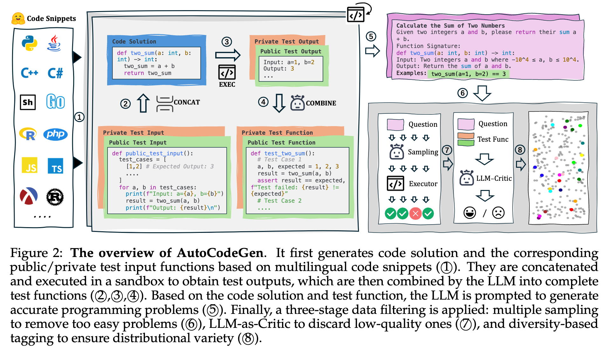
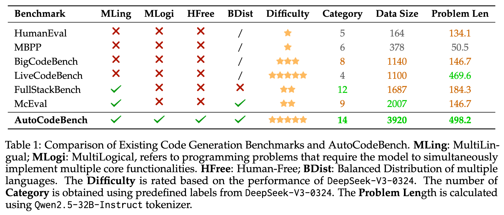
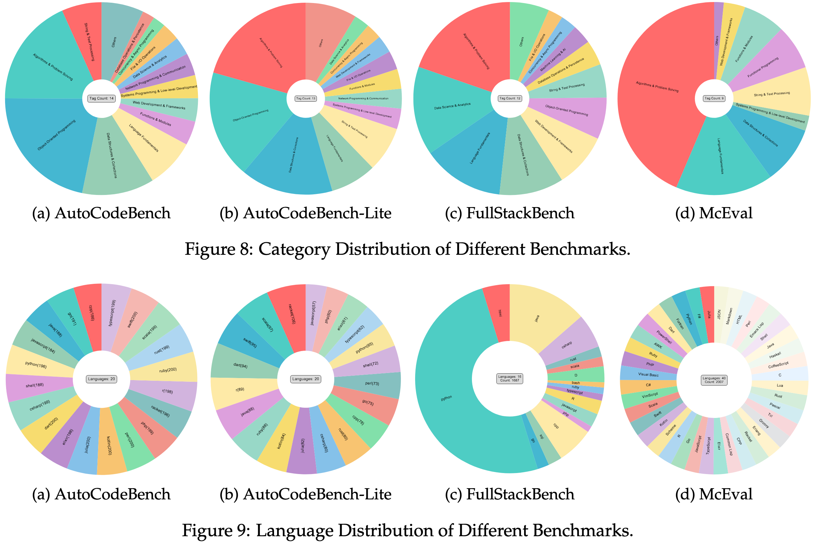
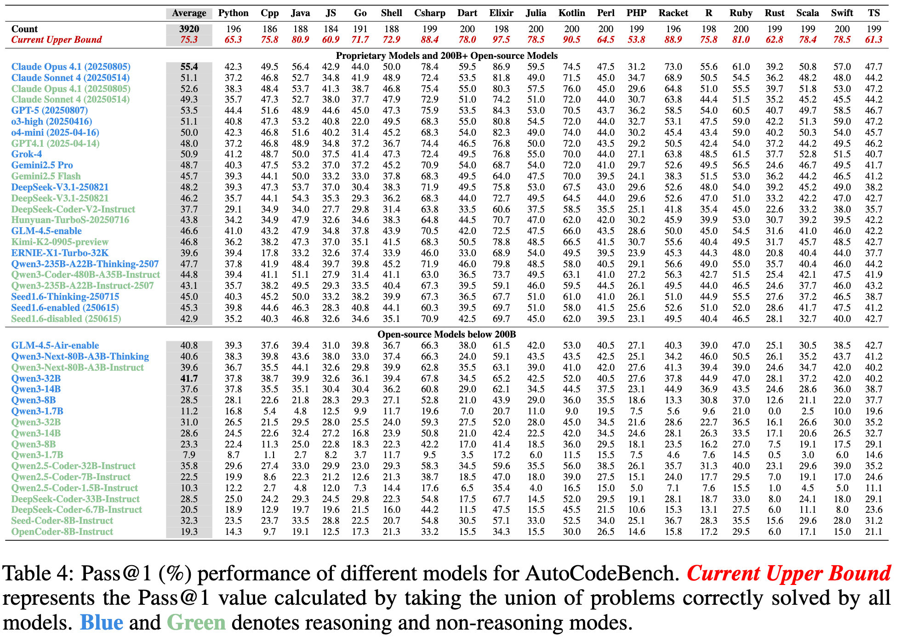
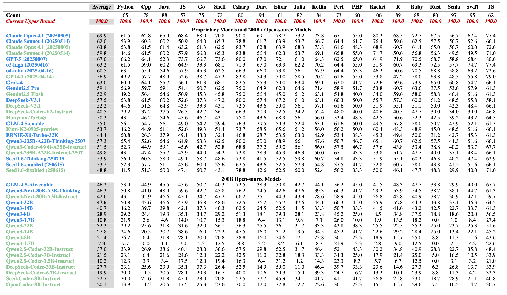
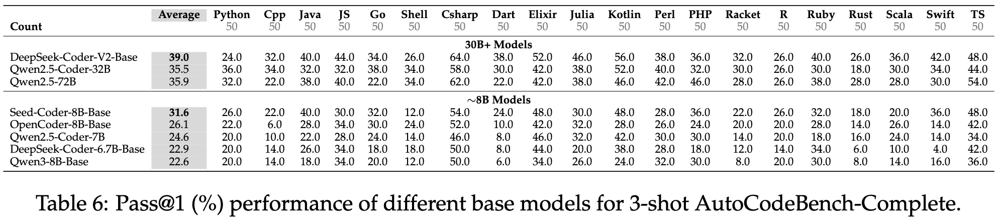

<div align="center">

# AutoCodeBench: Large Language Models are Automatic Code Benchmark Generators

**Hunyuan Team, Tencent**

</div>


<p align="center">
    <a href="https://arxiv.org/abs/2508.09101">📖 Paper</a> •
    <a href="https://autocodebench.github.io/">🏠 Home Page</a> •
    <a href="https://huggingface.co/datasets/tencent/AutoCodeBenchmark">💻 Data </a> •
    <a href="https://autocodebench.github.io/leaderboard.html">🏆 Leaderboard</a> •
    <a href="#citation">📜 Citation</a>
</p>


## Introduction

Existing code generation benchmarks often rely on manual annotations, which are time-consuming and difficult to scale across different programming languages and problem complexities. Besides, most benchmarks focus primarily on Python, while the few multilingual benchmarks suffer from limited difficulty and uneven language distribution. In this work, we propose:

**AutoCodeGen**. An automated workflow based on LLM-Sandbox Interaction, where *LLMs generate test inputs and obtain test outputs through the sandbox*, to create high-quality code generation benchmarks. Worth mentioning is that this workflow can also be applied to
synthesize high-quality training data.

**AutoCodeBench**. A large-scale code generation benchmark with 3,920 problems, evenly distributed across 20 programming languages. It features high difficulty, practicality, and diversity, and is designed to measure the absolute multilingual performance of models.

**AutoCodeBench-Lite**. Based on the evaluation results of 30+ open-source and closed-source models on AutoCodeBench, we select 1,586 problems that were successfully solved by at least two models. This simplified subset, AutoCodeBench-Lite, is used to measure performance differences between models.

**AutoCodeBench-Complete**. We select 1,000 problems from AutoCodeBench-Lite and use 3-shot prompting to construct AutoCodeBench-Complete, a completion-style code generation benchmark designed to assess the performance of base models.

## AutoCodeGen
<div align="center">
  
</div>

## AutoCodeBench
<div align="center">
  
</div>

Previous benchmarks mainly focused on Python, with multilingual benchmarks like Fullstackbench and McEval suffering from imbalanced language and category distributions, and overly simple difficulty. In contrast, AutoCodeBench is a high-difficulty multilingual benchmark with balanced language and category distributions to better assess models' multilingual capabilities.

<div align="center">
  
</div>


## Experimental Results

<div align="center">
  
</div>
<div align="center">
  
</div>
<div align="center">
  
</div>


## Data Description
Field Descriptions:
- question: The programming problem.
- canonical_solution: The code solution.
- demo_test_func: Public test function containing a few basic test cases.
- full_test_func: Private test function containing a large number of comprehensive test cases.
- language: The programming language used.
- difficulty: easy/medium/hard

**System Prompt**: `You are an expert programmer. Your task is to provide a code solution within a single Markdown code block for the given programming problem. Do not include any direct execution commands, test cases, or usage examples within the code block.`


## Evaluation

### 1. Prepare a file `model_output.jsonl`
You can use your model to perform inference based on the "question" field in the `autocodebench.jsonl` file and the system prompt, and save the model's output in the "output" field.

An example of using VLLM for infernece can be found in the file `run_vllm.sh`.


### 2. Pull the sandbox image
```bash
docker pull hunyuansandbox/multi-language-sandbox:v1
```

### 3. Start the sandbox service
```bash
cd MultiLanguageSandbox
```
```bash
docker run -d \
  --name sandbox-service \
  -p 8080:8080 \
  --cap-add=NET_ADMIN \
  hunyuansandbox/multi-language-sandbox:v1
```

### 4. Verify the service
```bash
# Check container status
docker ps | grep sandbox
```
```bash
# Test service health status. If the response contains `"exec_outcome": "PASSED"` in the JSON, it indicates the service is running normally.
curl -X POST http://localhost:8080/submit \
  -H "Content-Type: application/json" \
  -d '{"src_uid": "test-001", "lang": "python", "source_code": "print(\"Hello World\")"}'
```

```bash
# Verify canonical_solution, expected result pass@1=100%
python3 call_sandbox.py \
  --input_file AutoCodeBench/autocodebench.jsonl \
  --output autocodebench.exec.jsonl \
  --server_ip localhost \
  --server_port 8080 \
  --concurrency 32 \
  --solution_key canonical_solution
```


### 5. Calculate pass@1
```python
python3 call_sandbox.py \
  --input_file model_output.jsonl \
  --output model_output.exec.jsonl \
  --server_ip localhost \
  --server_port 8080 \
  --concurrency 32 \
  --solution_key output
```


## Citation

If you find our project helpful, please cite:

```bibtex
@misc{chou2025autocodebenchlargelanguagemodels,
      title={AutoCodeBench: Large Language Models are Automatic Code Benchmark Generators}, 
      author={Jason Chou and Ao Liu and Yuchi Deng and Zhiying Zeng and Tao Zhang and Haotian Zhu and Jianwei Cai and Yue Mao and Chenchen Zhang and Lingyun Tan and Ziyan Xu and Bohui Zhai and Hengyi Liu and Speed Zhu and Wiggin Zhou and Fengzong Lian},
      year={2025},
      eprint={2508.09101},
      archivePrefix={arXiv},
      primaryClass={cs.CL},
      url={https://arxiv.org/abs/2508.09101}, 
}
```


## License

This repository is licensed under the terms of the [LICENSE](LICENSE) file.


