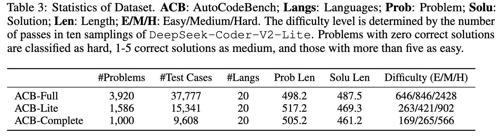

<div align="center">

# AutoCodeBench: Large Language Models are Automatic Code Benchmark Generators

**Hunyuan Team, Tencent**

</div>


<p align="center">
    <a href="https://arxiv.org/abs/2508.09101">📖 Paper</a> •
    <a href="https://autocodebench.github.io/">🏠 Home Page</a> •
    <a href="https://huggingface.co/datasets/tencent/AutoCodeBenchmark">💻 Data </a> •
    <a href="https://autocodebench.github.io/leaderboard.html">🏆 Leaderboard</a> •
    <a href="#citation">📜 Citation</a>
</p>


## Introduction

Existing code generation benchmarks typically rely on manual annotations, which are not only time-consuming but also challenging to scale across diverse programming languages and varying problem complexities. Furthermore, most existing benchmarks predominantly focus on Python, while the limited number of multilingual benchmarks suffer from insufficient difficulty levels and imbalanced language distribution. To address these limitations, we propose the following comprehensive solution:

**AutoCodeGen**: An innovative automated workflow leveraging LLM-Sandbox Interaction, where *LLMs dynamically generate test inputs and obtain corresponding test outputs through the sandbox environment*, enabling the creation of high-quality, scalable code generation datasets.

**AutoCodeBench**: A comprehensive, large-scale code generation benchmark comprising 3,920 carefully curated problems, featuring balanced distribution across 20 programming languages. This benchmark is characterized by its high difficulty levels, practical relevance, and linguistic diversity.

**AutoCodeBench-Lite**: Derived from extensive evaluation of over 30 open-source and closed-source models on AutoCodeBench, this refined subset contains 1,586 problems that demonstrate consistent solvability, having been successfully addressed by at least two different models.

**AutoCodeBench-Complete**: Constructed from 1,000 selected problems from AutoCodeBench-Lite, this benchmark employs 3-shot prompting to create a completion-style code generation assessment framework specifically designed to evaluate the performance capabilities of base models.

**MultiLanguageSandbox**: A robust, secure, and high-performance multi-language code execution sandbox service that provides comprehensive support for compilation and execution across more than 30 programming languages.


## AutoCodeGen
<div align="center">
  
</div>

## AutoCodeBench
<div align="center">
  
</div>

Previous benchmarks mainly focused on Python, with multilingual benchmarks like Fullstackbench and McEval suffering from imbalanced language and category distributions, and overly simple difficulty. In contrast, AutoCodeBench is a high-difficulty multilingual benchmark with balanced language and category distributions to better assess models' multilingual capabilities.

<div align="center">
  
</div>


## Experimental Results

<div align="center">
  
</div>
<div align="center">
  
</div>
<div align="center">
  
</div>


## Data Description

<div align="center">
  
</div>

Field Descriptions:
- question: The programming problem.
- canonical_solution: The code solution.
- demo_test_func: Public test function containing a few basic test cases.
- full_test_func: Private test function containing a large number of comprehensive test cases.
- language: The programming language used.
- difficulty: easy/medium/hard

**System Prompt**: `You are an expert programmer. Your task is to provide a code solution within a single Markdown code block for the given programming problem. Do not include any direct execution commands, test cases, or usage examples within the code block.`


## Evaluation

### 1. Prepare a file `model_output.jsonl`
You can use your model to perform inference based on the "question" field in the `autocodebench.jsonl` file and the system prompt, and save the model's output in the "output" field.

An example of using VLLM for infernece can be found in the file `run_vllm.sh`.


### 2. Pull the sandbox image
```bash
docker pull hunyuansandbox/multi-language-sandbox:v1
```

### 3. Start the sandbox service
```bash
cd MultiLanguageSandbox
```
```bash
docker run -d \
  --name sandbox-service \
  -p 8080:8080 \
  --cap-add=NET_ADMIN \
  hunyuansandbox/multi-language-sandbox:v1
```

### 4. Verify the service
```bash
# Check container status
docker ps | grep sandbox
```
```bash
# Test service health status. If the response contains `"exec_outcome": "PASSED"` in the JSON, it indicates the service is running normally.
curl -X POST http://localhost:8080/submit \
  -H "Content-Type: application/json" \
  -d '{"src_uid": "test-001", "lang": "python", "source_code": "print(\"Hello World\")"}'
```

```bash
# Verify canonical_solution, expected result pass@1=100%
python3 call_sandbox.py \
  --input_file AutoCodeBench/autocodebench.jsonl \
  --output autocodebench.exec.jsonl \
  --server_ip localhost \
  --server_port 8080 \
  --concurrency 32 \
  --solution_key canonical_solution
```


### 5. Calculate pass@1
```python
python3 call_sandbox.py \
  --input_file model_output.jsonl \
  --output model_output.exec.jsonl \
  --server_ip localhost \
  --server_port 8080 \
  --concurrency 32 \
  --solution_key output
```


## Citation

If you find our project helpful, please cite:

```bibtex
@misc{chou2025autocodebenchlargelanguagemodels,
      title={AutoCodeBench: Large Language Models are Automatic Code Benchmark Generators}, 
      author={Jason Chou and Ao Liu and Yuchi Deng and Zhiying Zeng and Tao Zhang and Haotian Zhu and Jianwei Cai and Yue Mao and Chenchen Zhang and Lingyun Tan and Ziyan Xu and Bohui Zhai and Hengyi Liu and Speed Zhu and Wiggin Zhou and Fengzong Lian},
      year={2025},
      eprint={2508.09101},
      archivePrefix={arXiv},
      primaryClass={cs.CL},
      url={https://arxiv.org/abs/2508.09101}, 
}
```


## License

This repository is licensed under the terms of the [LICENSE](LICENSE) file.


